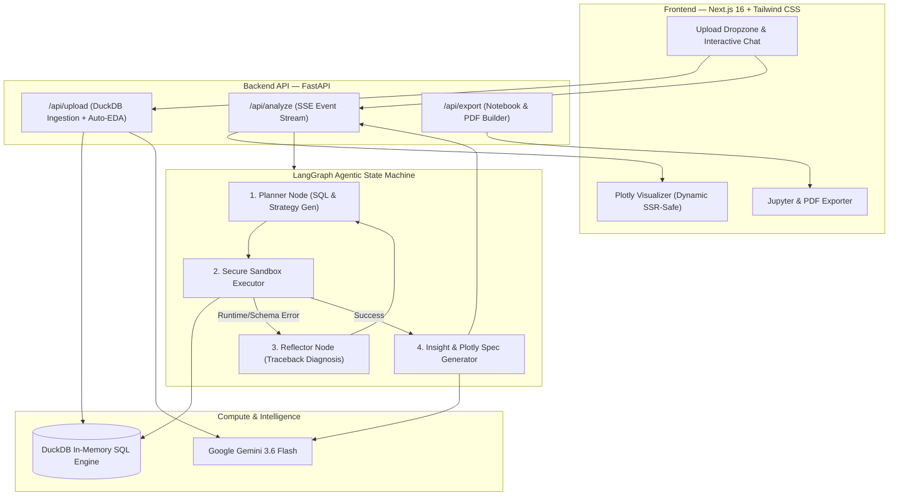

<div align="center">

# 📊 yourlocalANALYST
### Autonomous, Self-Correcting GenAI Data Analyst & Visualization Engine

[](https://yourlocalanalyst.vercel.app)
[](https://fastapi.tiangolo.com)
[](https://nextjs.org/)
[](https://duckdb.org/)
[](https://langchain-ai.github.io/langgraph/)
[](https://aistudio.google.com/)
[](https://plotly.com/)
[](https://opensource.org/licenses/MIT)

<p align="center">
  🌐 <b>Live Web App:</b> <a href="https://yourlocalanalyst.vercel.app">yourlocalanalyst.vercel.app</a>
</p>

<p align="center">
  <b>Upload your raw CSVs. Ask questions in plain English. Watch your agent plan, write SQL, self-heal errors, and generate executive briefings with interactive charts.</b>
</p>

[Key Features](#-key-features) • [Architecture](#-architecture) • [How It Works](#-how-the-self-healing-agent-works) • [Quick Start](#-quick-start) • [Tech Stack](#-tech-stack) • [Security](#-enterprise-grade-security-sandbox)

---

</div>

## 💡 What is yourlocalANALYST?

**yourlocalANALYST** turns complex tabular data analysis into an effortless, conversational experience. Instead of brittle scripts or simple LLM wrappers that crash on complex queries, **yourlocalANALYST** runs a **state-machine agentic loop powered by LangGraph**:

1. **Plans** the analytical strategy.
2. **Generates & executes** DuckDB SQL queries against in-memory tables.
3. **Catches & inspects tracebacks** to self-heal up to 3 times automatically if syntax or column errors occur.
4. **Validates sanity** (ensures outputs aren't empty or ungrounded).
5. **Synthesizes executive insights** with exact percentages, KPIs, and interactive Plotly visualizations.
6. **Exports reproducible artifacts** directly to **Jupyter Notebook (`.ipynb`)** and **Executive PDF Reports**.

---

## ✨ Key Features

| Capability | What Makes It Stand Out |
| :--- | :--- |
| 🧠 **Self-Healing Agent Loop** | If code throws a syntax or schema error, the agent intercepts the traceback, re-inspects the DuckDB schema, and automatically repairs its query in real time. |
| ⚡ **Zero-Click Auto-EDA** | The instant you drop a CSV, the agent profiles missing values, column data types, distributions, generates a 30-second executive summary, and suggests 5 high-value questions. |
| 📁 **Multi-Table Relational Queries** | Upload multiple CSVs (e.g. `orders.csv`, `customers.csv`, `products.csv`). DuckDB registers them all into an in-memory relational schema ready for complex joins. |
| 📊 **Interactive Plotly Canvas** | Hover, zoom, pan, select, and export charts to high-res PNG directly in the browser. |
| 🛡️ **AST-Level Code Sandboxing** | Pure Python AST parsing actively scans generated code, blocking dangerous syscalls and modules (`os`, `sys`, `subprocess`, `socket`). |
| 💬 **Live SSE Progress Streaming** | Watch the agent think and execute live with real-time step notifications ("Planning query...", "Executing...", "Generating insights..."). |
| 📥 **Export to Notebook & PDF** | Convert any analysis session into a full Jupyter Notebook (`.ipynb`) or an executive-ready PDF report with a single click. |

---

## 🏗️ Architecture



---

## 🔄 How the Self-Healing Agent Works

Most standard AI analyst tools fail when an LLM hallucinates a non-existent column name or syntax edge case. **yourlocalANALYST** implements a resilient feedback loop:

```
[User Question] 
      │
      ▼
┌──────────────┐
│ Planner Node │ ◄───────────────────────────┐
└──────┬───────┘                             │
       │ Generates SQL/Python                 │ (Self-Correction Loop: Max 3 Tries)
       ▼                                     │
┌───────────────┐     Error Detected         │
│ Executor Node │ ───────────────────────────┤
└──────┬────────┘ (KeyError, ColumnNotFound, │
       │ Success  Syntax Error)              │
       ▼                                     ▼
┌──────────────┐                     ┌────────────────┐
│ Insight Node │                     │ Reflector Node │
└──────┬───────┘                     └────────────────┘
       │
       ▼
[Interactive Plotly Spec + 3-Bullet Executive Narrative + Data Table]
```

---

## 🚀 Quick Start

### Prerequisites
- **Python 3.11+**
- **Node.js 18+**
- A free **Google Gemini API Key** ([Get one at AI Studio](https://aistudio.google.com/apikey))

---

### 1. Clone & Setup Backend

```bash
# Clone the repository
git clone https://github.com/ANKARAHAMSA/yourlocalANALYST.git
cd yourlocalANALYST/backend

# Create and activate virtual environment
python3 -m venv venv
source venv/bin/activate  # On Windows: venv\Scripts\activate

# Install dependencies
pip install -r requirements.txt

# Configure your Gemini API key
cp .env.example .env
# Edit .env and paste: GEMINI_API_KEY=your_actual_key_here

# Launch the FastAPI backend
uvicorn main:app --reload --port 8000
```
Backend will be running at `http://localhost:8000` with interactive Swagger docs at `http://localhost:8000/docs`.

---

### 2. Setup Frontend

In a new terminal:

```bash
cd yourlocalANALYST/frontend

# Install dependencies
npm install

# Launch Next.js dev server
npm run dev
```
Open **`http://localhost:3000`** in your browser!

---

## 📁 Repository Structure

```
yourlocalANALYST/
├── backend/
│   ├── main.py                  # FastAPI application entrypoint & lifecycle
│   ├── requirements.txt         # Production backend dependencies
│   ├── .env.example             # Environment template
│   ├── agent/
│   │   ├── graph.py             # LangGraph state machine (Plan/Exec/Reflect/Insight)
│   │   ├── sandbox.py           # AST-based Python sandbox & DuckDB executor
│   │   ├── eda.py               # Automated EDA profiler & summary engine
│   │   └── prompts.py           # System prompts with strict JSON schemas
│   ├── routers/
│   │   ├── upload.py            # CSV ingestion & DuckDB session manager
│   │   ├── analyze.py           # Server-Sent Events (SSE) streaming endpoint
│   │   └── export.py            # Jupyter Notebook (.ipynb) & PDF export router
│   └── models/
│       └── schemas.py           # Pydantic data contracts
│
├── frontend/
│   ├── app/
│   │   ├── page.tsx             # Main dashboard & SSE stream consumer
│   │   ├── layout.tsx           # Dark mode application shell
│   │   ├── types.ts             # Shared TypeScript models
│   │   └── components/
│   │       ├── FileUploader.tsx # Drag-and-drop CSV uploader & EDA viewer
│   │       ├── ChatPanel.tsx    # Real-time streaming conversation feed
│   │       ├── ChartViewer.tsx  # Dynamic Plotly chart renderer
│   │       ├── InsightCard.tsx  # Executive bullet takeaways
│   │       ├── DataTable.tsx    # Raw SQL results table viewer
│   │       └── ExportBar.tsx    # One-click Notebook/PDF export buttons
│   ├── package.json
│   └── tailwind.config.ts
│
├── .gitignore
└── README.md
```

---

## 🛡️ Enterprise-Grade Security Sandbox

Executing AI-generated code is inherently dangerous if unconstrained. **yourlocalANALYST** applies a **defense-in-depth security model**:

1. **Abstract Syntax Tree (AST) Inspection:** Every generated snippet is parsed and validated before compilation. Imports of dangerous modules (`os`, `sys`, `subprocess`, `socket`, `shutil`, `pickle`, `ctypes`, etc.) are halted with a `SecurityError`.
2. **Builtins Sanitization:** Dynamic code evaluation occurs inside a restricted namespace where dangerous builtins (`eval`, `exec`, `open`, `compile`) are blocked.
3. **In-Memory Sandboxed DuckDB:** SQL queries run against isolated, in-memory ephemeral databases without persistent filesystem access permissions.

---

## 🛠️ Tech Stack

- **Large Language Model:** Google Gemini 3.6 Flash
- **Agent Orchestration:** LangGraph (StateGraph)
- **Analytical Engine:** DuckDB & Pandas
- **Backend API:** FastAPI with Starlette SSE (Server-Sent Events)
- **Frontend Framework:** Next.js 16 (App Router, Turbopack) & React 19
- **Styling:** Tailwind CSS & Lucide React
- **Visualization:** Plotly & `react-plotly.js`
- **Exporting Tools:** `nbformat` (Jupyter) & `fpdf2` (Portable Document Format)

---

## 🤝 Contributing

Contributions, issues, and feature requests are welcome! Feel free to check the [issues page](https://github.com/ANKARAHAMSA/yourlocalANALYST/issues).

1. Fork the Project
2. Create your Feature Branch (`git checkout -b feature/AmazingFeature`)
3. Commit your Changes (`git commit -m 'Add some AmazingFeature'`)
4. Push to the Branch (`git push origin feature/AmazingFeature`)
5. Open a Pull Request

---

## 📝 License

Distributed under the **MIT License**. See `LICENSE` for more information.

<div align="center">
  <sub>Built with ❤️ by <a href="https://github.com/ANKARAHAMSA">Shahin Hamza</a></sub>
</div>
